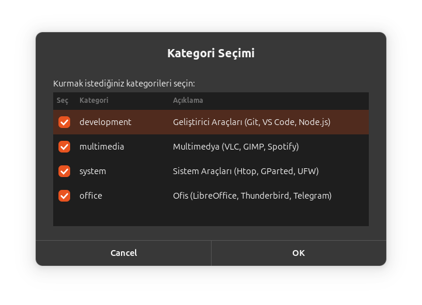
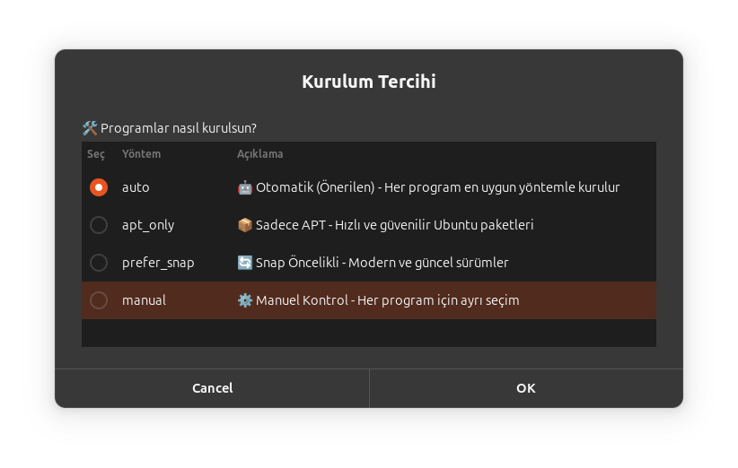
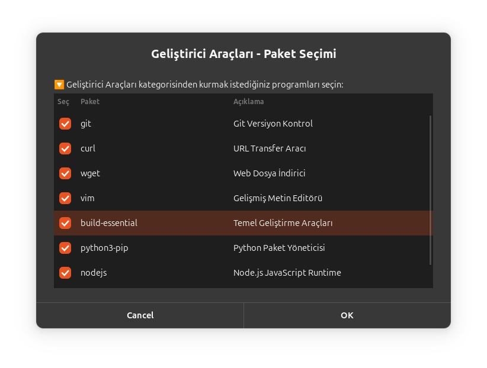
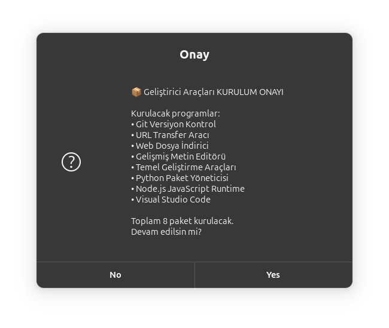
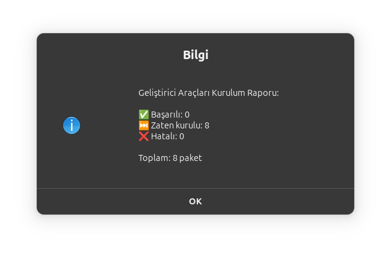

# Ubuntu Program Kurulum Yöneticisi 🚀


Ubuntu için geliştirilmiş, kullanıcı dostu bir program kurulum aracı. Terminal bilgisi gerektirmeden tek tıkla program kurulumu yapabilirsiniz.

## 🌟 Özellikler

- **Kolay Kullanım**: Grafiksel arayüz ile basit kurulum
- **Kategori Desteği**: Programlar kategorilere ayrılmış durumda
- **Çoklu Kurulum**: Birden fazla programı aynı anda kurabilme
- **Güvenli**: Sudo yetkisi ile güvenli kurulum
- **Log Sistemi**: Tüm işlemler kayıt altına alınır
- **Türkçe Arayüz**: Tamamen Türkçe kullanıcı deneyimi

## 📸 Ekran Görüntüleri

### Ana Menü

*Programın ana menüsü - tüm işlemler buradan başlar*

### Kategori Seçimi

*Kurulum yapılacak program kategorilerini seçin*

### Kurulum Tercihi

*Kurulum yöntemini belirleyin*

### Program Seçimi

*Kategoriye göre programları seçin*

### Kurulum Onayı

*Seçilen programları gözden geçirin ve onaylayın*

### Kurulum Raporu

*Kurulum sonuçlarını görüntüleyin*

## 🛠️ Kurulum

### Gereksinimler
- Ubuntu 20.04 veya üzeri
- Zenity paketi (otomatik kurulur)
- Sudo yetkisi

### Kurulum Adımları

1. Repoyu klonlayın:
```bash
git clone https://github.com/alibedirhan/ubuntu-app-ins.git
cd ubuntu-app-ins
```

2. Çalıştırma izni verin:
```bash
chmod +x application-installer.sh
```

3. Programı başlatın:
```bash
./application-installer.sh
```

## 📦 Desteklenen Programlar

### Geliştirici Araçları
- Git, VS Code, Node.js, Vim, Curl, Wget
- Python, Build Essential araçları

### Multimedya
- VLC, GIMP, Spotify, Audacity
- OBS Studio, Kdenlive

### Sistem Araçları
- Htop, GParted, UFW, Neofetch
- TimeShift, BleachBit

### Ofis Uygulamaları
- LibreOffice, Thunderbird, Telegram

## 💻 Kullanım

1. Programı başlattığınızda ana menü açılır
2. "install" seçeneğini seçin
3. Kurmak istediğiniz kategorileri işaretleyin
4. Kurulum yöntemini seçin (Otomatik önerilir)
5. Kurulum modunu seçin (Seçmeli veya Tam)
6. Programları seçin ve onaylayın
7. Sudo şifrenizi girin
8. Kurulum tamamlanana kadar bekleyin

## 📝 Log Dosyası

Tüm kurulum işlemleri `kurulum.log` dosyasına kaydedilir. Bu dosyayı incelemek için:
- Ana menüden "show_log" seçeneğini kullanın
- Veya terminal ile: `cat kurulum.log`

## 🤝 Katkıda Bulunma

1. Bu repoyu fork edin
2. Yeni bir branch oluşturun (`git checkout -b yeni-ozellik`)
3. Değişikliklerinizi commit edin (`git commit -am 'Yeni özellik eklendi'`)
4. Branch'inizi push edin (`git push origin yeni-ozellik`)
5. Pull Request açın

## 📄 Lisans

Bu proje MIT lisansı altında lisanslanmıştır. Detaylar için [LICENSE](LICENSE) dosyasına bakın.


**Not**: Sorun yaşarsanız [Issues](https://github.com/alibedirhan/ubuntu-app-ins/issues) bölümünden bildirebilirsiniz.
